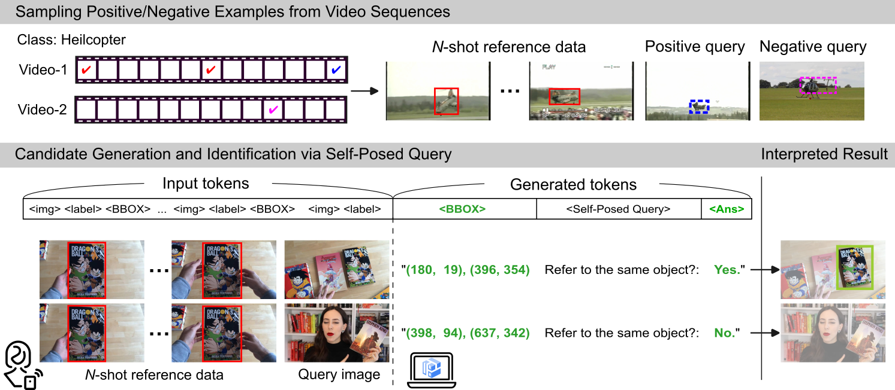
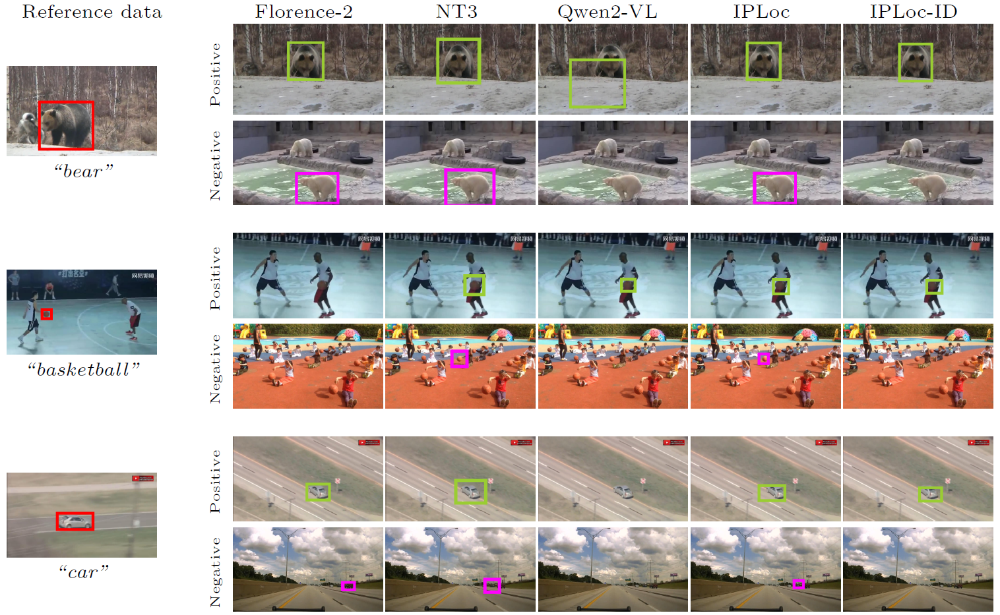

<p align="center">
  
</p>
<p align="center">
  <em>Figure 1. Framework of IPLoc-ID.</em>
</p>


<p align="center">
  
</p>
<p align="center">
  <em>Figure 2. IPLoc-ID reduces false-positive detections on negative query images, shown by magenta boxes, while maintaining correct target localization shown in green.</em>
</p>


# Official Code of IPLoc-ID

This repository provides the HuggingFace implementation (PyTorch) of the paper:

**Personalized Object Identification and Localization via In-Context Inference with Vision-Language Models**

[[arXiv]](https://arxiv.org/abs/2607.00357)

This paper is currently under review.

At this stage, we provide dataset construction scripts, inference implementation, and a minimal trained model. 
The training code and additional trained models will be released upon acceptance.

# Installation

Create and activate the Conda environment:

```bash
conda create -n iplocid python=3.9 -y
conda activate iplocid
```

Install the required packages:

```bash
pip install -U accelerate pillow
pip install -U git+https://github.com/huggingface/transformers
python -m pip install -U peft
python -m pip install -U torchvision
python -m pip install -U pandas
python -m pip install -U scipy
python -m pip install -U qwen-vl-utils
pip install matplotlib scikit-image
pip install wonderwords
conda install -c conda-forge pycocotools
pip install einops timm
```

Configure Accelerate and select `bf16` when prompted:

```bash
accelerate config
```

# Dataset Preparation

Please prepare the input data according to the dataset format described below.

Step 1: Download the original datasets, LaSOT, PDM (BURST), GOT-10k, and VastTrack, from their official websites.

Step 2: Place the source datasets under the following directory structure:

```text
/ssd1/dataset/ICL_tracking
                └── video
                    ├── LASOT
                    │   └── <class>
                    │       └── <subclass>
                    ├── burst
                    │   ├── annotations
                    │   └── frames
                    ├── got10k
                    │   └── val
                    │       └── <class>
                    └── VastTrack
                        └── <class>
                            └── <subclass>
```

Step 3: Run the following command to export the minimum set of images required to run the input data JSON files (`./data/*.json`) from `/ssd1/dataset/ICL_tracking` to `/ssd1/dataset/ICL_tracking_minimized`.

```bash
bash iplocid/extract_dataset.sh
```

Alternatively, you can generate the input data JSON files from scratch by running the following command. In this case, `/ssd1/dataset/ICL_tracking_minimized` will also be generated automatically.

```bash
bash iplocid/shell_build_data-json.sh
```

# Model Download

Complete model sets will be released upon acceptance.

Step 1: Download the trained model directories from the following Google Drive folder:

- [IPLoc-ID model files](https://drive.google.com/drive/folders/1QQiz6nf95FzelkIExOmVy5kR4vZfYIDI?usp=sharing)

The folder contains:

```text
Qwen3-VL-8B-Instruct_1shot_iplocid:  the trained IPLoc-ID model
Qwen3-VL-8B-Instruct_1shot_iploc: reproduced IPLoc model
```

If necessary, download the pretrained weights from the previous work, IPLoc, from the **Model Download** section of the following repository:

https://github.com/SivanDoveh/IPLoc

Specifically, please download `QWEN2-VL-ICL-LOC`.

Step 2: Place the pretrained weights as follows:

```text
├── iplocid
└── pretrained_weights
    ├── Qwen3-VL-8B-Instruct_1shot_iplocid       # our trained IPLoc-ID model
    ├── Qwen3-VL-8B-Instruct_1shot_iploc         # our reproduced IPLoc model
    ├── ...
    └── Qwen2VL-7b-ICL-Loc                 # original IPLoc model
```

# Inference

Run the inference script as follows:

```bash
bash iplocid/inference.sh
```

# Training

The training code will be released upon acceptance.

After release, the training script can be run as follows:

```bash
bash iplocid/training.sh
```

# Evaluation

The evaluation script can be run as follows:

```bash
bash iplocid/evaluation.sh
```

# Citation

If you find this repository useful, please cite our paper:

```bibtex
@article{nakamura2026iplocid,
  title   = {Personalized Object Identification and Localization via In-Context Inference with Vision-Language Models},
  author  = {Nakamura, Kensuke and Hong, Byung-Woo},
  journal = {arXiv preprint arXiv:2607.00357},
  year    = {2026}
}
```

# Acknowledgement

This work is built upon the pioneering work of Doveh et al.:

Sivan Doveh et al., “Teaching VLMs to Localize Specific Objects from In-Context Examples,” Proceedings of the IEEE/CVF International Conference on Computer Vision (ICCV), 2025.
